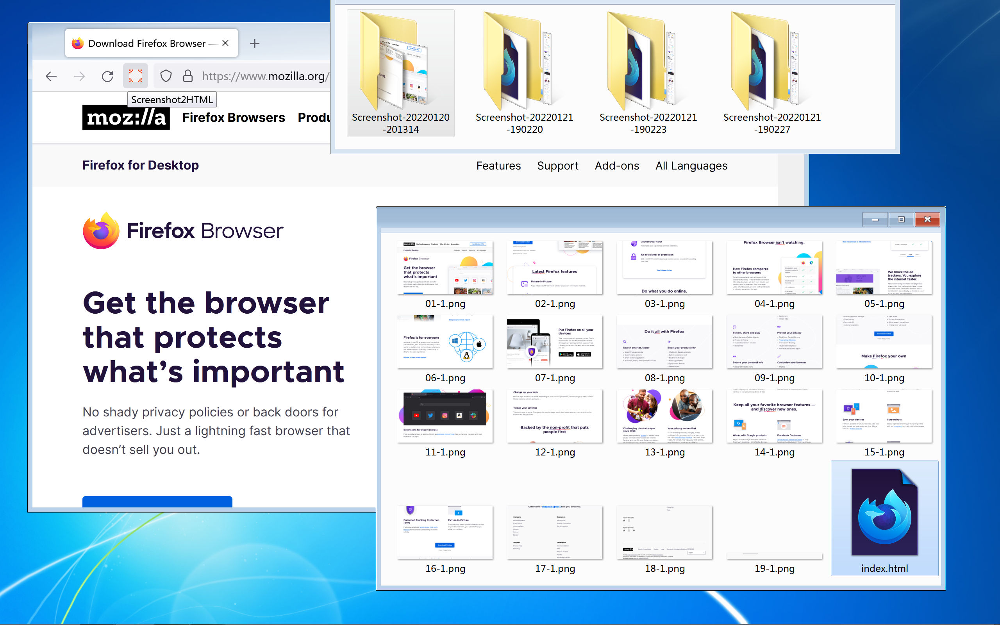

Screenshot2HTML
=================

Take a full page screenshot and save it as a single page HTML file.

Features:
- unlimited capture area
- images in PNG or JPEG format
- selectable text embedded like PDF (basic support)
- support for right-to-left scrolling
- single HTML + images = maximum portability
- support for even Firefox version 52
- no re-download, no network connection required

Download:
- https://addons.mozilla.org/addon/screenshot2html/

Hacking:
- https://github.com/jakwings/screenshot2html/archive/refs/heads/master.zip
- https://developer.mozilla.org/Add-ons/WebExtensions/Temporary_Installation_in_Firefox

Localization:
- https://lusito.github.io/web-ext-translator/?gh=https://github.com/jakwings/screenshot2html

Other useful tools:
- https://github.com/jakwings/firefox-screenshot
- https://github.com/iipc/awesome-web-archiving
- https://github.com/webrecorder/pywb
- https://github.com/internetarchive/warcprox
- `wget --warc-file`

Note: [ManifestV2 extension might not be permitted to be *signed* by Mozilla in the future](https://blog.mozilla.org/addons/2022/05/18/manifest-v3-in-firefox-recap-next-steps/), which could mean that legacy browsers (except for modified versions of Firefox) can't receive automatic updates of this extension.
